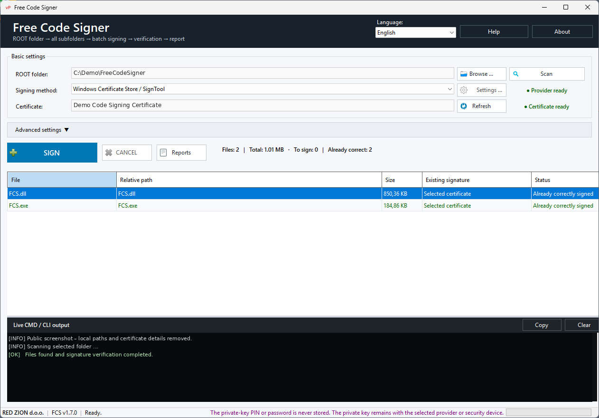
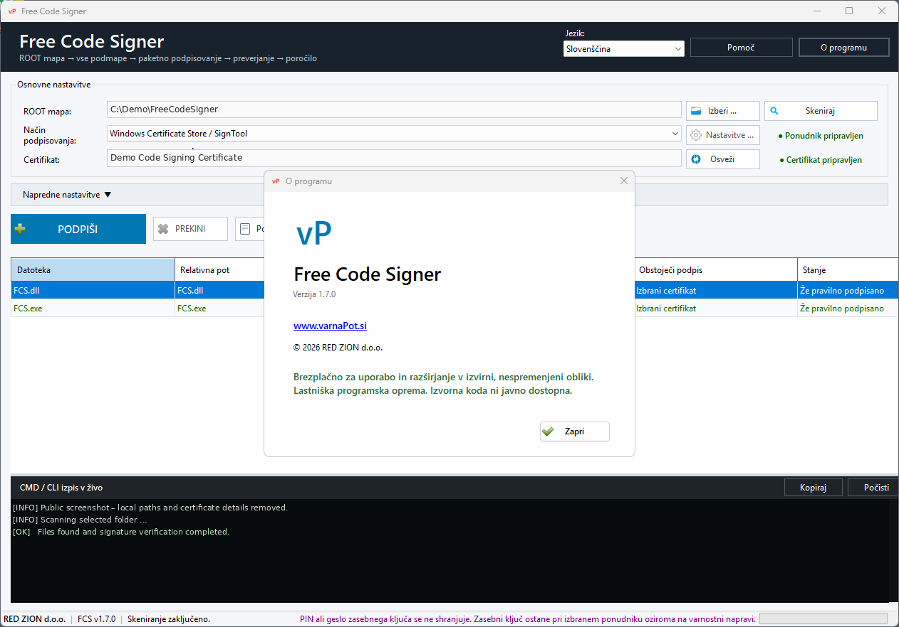

# Free Code Signer v1.7.0 — Navodila za uporabo

[← Nazaj na README](README.md) · [English Help](HELP-EN.md) · [Prenos v1.7.0](https://github.com/varnaPot/FreeCodeSigner/releases/tag/v1.7.0)

## 1. Hiter začetek

1. Zaženi Free Code Signer.
2. Izberi korensko mapo, v kateri so datoteke za podpis.
3. Izberi način podpisovanja.
4. Nastavi oziroma izberi certifikat ali ponudnika podpisovanja.
5. Izberi profil datotek ali ročno uredi seznam končnic.
6. Po potrebi nastavi časovni žig.
7. Skeniraj mapo.
8. Preglej najdene datoteke in trenutno stanje podpisov.
9. Začni podpisovanje.
10. Preglej rezultat oziroma poročilo.

## 2. Način podpisovanja

Izberi način, ki ustreza tvojemu okolju.

### Microsoft SignTool / Windows Certificate Store

Ta način uporabi za klasično Windows Authenticode podpisovanje.

Primeri uporabe:

- lokalno nameščen Code Signing certifikat
- certifikat v Windows Certificate Store
- certifikat na YubiKey/PIV
- združljiv HSM, ki je Windowsu izpostavljen prek kriptografskega ponudnika

### Azure Artifact Signing

Azure Artifact Signing uporabi, kadar sta podpisna identiteta in zasebni ključ zaščitena v Microsoftovi cloud infrastrukturi.

Nastavitve so odvisne od Azure signing resource/profile in načina prijave, ki ga uporablja tvoje okolje.

### Google Cloud KMS

Google Cloud KMS uporabi, kadar je zasebni podpisni ključ zaščiten v Google Cloud okolju.

Za integracijo podpisnega postopka se uporablja Jsign.

### Jsign

Generični način Jsign je namenjen združljivim KMS, HSM, PKCS#11, hardware-token in remote-signing okoljem.

Dodatne možnosti:

## 3. JAR datoteke

Java `.jar` datoteke ne uporabljajo Windows Authenticode podpisovanja.

Free Code Signer jih zato obravnava z Java orodjem `jarsigner`.

Potrebno je:

- združljiv JDK
- dostopen/nastavljen `jarsigner`
- ustrezen dostop do certifikata oziroma ključa glede na izbrani način podpisovanja

Profil **Razširjeno + JAR** omogoča, da JAR datoteke vključiš v isti delovni postopek z ostalimi tipi datotek, podpis pa se še vedno izvede z ustreznim Java mehanizmom.

## 4. Profili datotek in končnice

Uporabiš lahko prednastavljene profile ali seznam končnic urejaš ročno.

### Standardno

Za najpogostejše Windows tipe datotek za Code Signing.

### Razširjeno

Za širši nabor združljivih formatov.

### Razširjeno + JAR

Razširjenemu izboru doda Java JAR podpisovanje.

### Po meri

Za popoln ročni nadzor nad seznamom končnic.

Ročno urejanje ostane na voljo tudi ob uporabi prednastavljenih profilov.

## 5. Napredne nastavitve

Nekateri ponudniki potrebujejo dodatne parametre.

Vnesi samo podatke, ki jih zahteva izbrani ponudnik. Kadar obstaja varnejši način prijave, se izogibaj shranjevanju skrivnosti v navadnem besedilu.

## 6. Časovni žig

Zaupanja vreden časovni žig potrdi, kdaj je bila datoteka podpisana.

Zakaj je pomemben:

- podpis lahko ostane veljaven tudi po poteku podpisnega certifikata
- preverjanje lahko potrdi, da je bil certifikat ob času podpisa veljaven
- za produkcijsko podpisovanje je časovni žig praviloma priporočljiv

Razpoložljivost in podprti algoritmi so odvisni od izbranega ponudnika in timestamp storitve.

## 7. Preverjanje podpisa

Free Code Signer lahko preverja podpise pred in po podpisovanju.

Rezultat vedno preveri, predvsem kadar:

- zamenjaš certifikat ali ponudnika
- prvič nastavljaš cloud podpisovanje
- začneš podpisovati nov tip datoteke
- zamenjaš timestamp strežnik
- prvič podpisuješ JAR datoteke

## 8. Vgrajena offline pomoč

Pritisni **F1** ali klikni **Pomoč**.

Pomoč v programu deluje tudi brez internetne povezave.

## 9. Jezik

Free Code Signer vključuje 25 jezikov uporabniškega vmesnika.

Zadnji izbrani jezik se samodejno shrani in obnovi ob naslednjem zagonu.

Primer angleškega vmesnika:

Podprti jeziki:

bolgarščina, hrvaščina, češčina, danščina, nizozemščina, angleščina, estonščina, finščina, francoščina, nemščina, grščina, madžarščina, irščina, italijanščina, latvijščina, litovščina, malteščina, poljščina, portugalščina, romunščina, slovaščina, slovenščina, španščina, švedščina in ukrajinščina.

## 10. Varnostna priporočila

Priporočeno:

- zasebne ključe pusti v Certificate Store, hardware tokenu, HSM ali cloud KMS
- PIN-ov, gesel in client secretov ne objavljaj v screenshotih ali logih
- kadar je mogoče uporabljaj kratkoživo/provider-managed avtentikacijo
- pravice do cloud signing virov omeji po načelu najmanjših potrebnih pravic
- pred objavo vedno preveri podpis končnih binarnih datotek
- za produkcijske izdaje uporabljaj časovni žig

Free Code Signer je zasnovan tako, da občutljivih podpisnih podatkov ni treba zapisovati v običajne nastavitve programa.

## 11. Pogoste težave

### Certifikata ni mogoče najti

- preveri, ali je certifikat dostopen trenutnemu uporabniku
- preveri middleware za hardware token/HSM
- preveri, ali je certifikat veljaven za Code Signing
- po potrebi ponovno priklopi oziroma odklene napravo

### SignTool ni najden

Namesti/nastavi Microsoft SignTool iz združljivega Windows SDK ali programu nastavi pravilno pot do izvršne datoteke.

### Jsign ni najden

Preveri nastavljeno pot do Jsign in zahtevano Java okolje.

### JDK / jarsigner ni najden

Namesti združljiv JDK in preveri, ali je `jarsigner` dostopen.

### Azure prijava ne uspe

Preveri Azure avtentikacijo, pravice, resource/profile nastavitve in omrežni dostop.

### Google Cloud KMS prijava ne uspe

Preveri Google Cloud prijavo, identifikatorje projekta/virov, pravice do ključa in Jsign nastavitve.

### Timestamp ne uspe

Ponovi postopek, preveri internetno povezavo ter dostopnost in združljivost timestamp storitve.

## 12. O programu

## Prenos

**[Prenesi Free Code Signer v1.7.0](https://github.com/varnaPot/FreeCodeSigner/releases/tag/v1.7.0)**

---

Free Code Signer je freeware.  
© 2026 RED ZION d.o.o.
