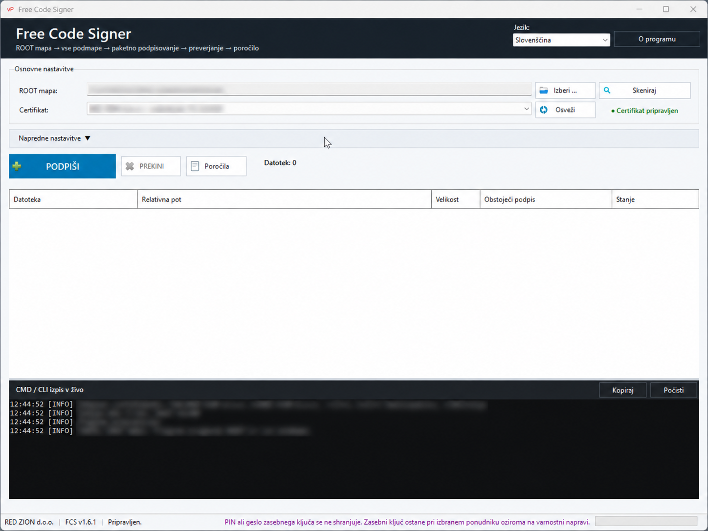

# Free Code Signer

**Free multilingual Windows GUI for Microsoft SignTool and hardware-backed Code Signing.**

Free Code Signer simplifies batch signing of Windows applications using Microsoft SignTool, YubiKey PIV, HSM devices and other compatible Code Signing solutions.

## Screenshot

## Features

- Batch signing of EXE, DLL, MSI and OCX files
- ROOT folder and recursive subfolder scanning
- Microsoft SignTool integration
- YubiKey PIV and compatible HSM support
- Reduced repeated PIN prompts through batch signing
- Automatic signature verification
- RFC3161 timestamping
- Detection of existing signatures
- Option to skip files already validly signed
- TXT and CSV reports
- Live CMD / CLI output
- 25 interface languages
- Windows x64

## Download

The latest version is available from GitHub Releases.

**Current version: Free Code Signer v1.6.1**

Official website:

https://www.varnapot.si/

Direct download from varnaPot.si:

https://www.varnapot.si/prenosi/FCS.zip

## Security

Free Code Signer does not store your private-key PIN or password.

The private key remains on the selected hardware security device or with the selected cryptographic provider.

Signing is performed using Microsoft SignTool.

Free Code Signer can reduce repeated PIN prompts by grouping multiple files into as few SignTool signing processes as possible. The exact PIN behavior depends on the hardware token, HSM, cryptographic provider and its security policy.

## Supported signing environments

Free Code Signer was designed and tested with hardware-backed Code Signing environments, including YubiKey PIV.

It can also be used with other smart cards, USB Code Signing tokens and HSM solutions when the certificate and private key are correctly available to Windows and Microsoft SignTool.

## License

© 2026 RED ZION d.o.o.

Free to use and redistribute in its original, unmodified form.

Proprietary software. Source code is not publicly distributed.

See `LICENSE.txt` for complete license terms.

---

# Slovenščina

## Free Code Signer

**Brezplačen večjezični Windows vmesnik za Microsoft SignTool in strojno zaščiten Code Signing.**

Free Code Signer poenostavi paketno digitalno podpisovanje Windows programske opreme z Microsoft SignToolom, YubiKey PIV, HSM napravami in drugimi združljivimi Code Signing rešitvami.

## Glavne funkcije

- Paketno podpisovanje EXE, DLL, MSI in OCX datotek
- Pregled ROOT mape in vseh podmap
- Integracija z Microsoft SignTool
- Podpora YubiKey PIV in združljivim HSM napravam
- Manj ponavljajočega vnašanja PIN-a zaradi paketnega podpisovanja
- Samodejno preverjanje digitalnih podpisov
- RFC3161 časovni žig
- Preverjanje obstoječih podpisov
- Možnost preskoka datotek, ki so že veljavno podpisane
- TXT in CSV poročila
- CMD / CLI izpis v živo
- 25 jezikov uporabniškega vmesnika
- Windows x64

## Prenos

Najnovejša različica je na voljo v GitHub Releases.

**Trenutna različica: Free Code Signer v1.6.1**

Uradna spletna stran:

https://www.varnapot.si/

Neposredni prenos z varnaPot.si:

https://www.varnapot.si/prenosi/FCS.zip

## Varnost

Free Code Signer ne shranjuje PIN-a ali gesla zasebnega ključa.

Zasebni ključ ostane na izbrani varnostni napravi oziroma pri izbranem kriptografskem ponudniku.

Podpisovanje izvaja Microsoft SignTool.

Free Code Signer lahko zmanjša število ponavljajočih zahtev za PIN tako, da več datotek združi v čim manj SignTool podpisovalnih procesov. Natančno obnašanje PIN-a je odvisno od varnostnega ključka, HSM naprave, kriptografskega ponudnika in njegove varnostne politike.

## Podprta podpisovalna okolja

Free Code Signer je bil zasnovan in preizkušen za strojno zaščitena Code Signing okolja, vključno z YubiKey PIV.

Uporabljati ga je mogoče tudi z drugimi pametnimi karticami, USB Code Signing ključki in HSM rešitvami, če sta certifikat in zasebni ključ pravilno dostopna sistemu Windows in Microsoft SignToolu.

## Licenca

© 2026 RED ZION d.o.o.

Brezplačno za uporabo in razširjanje v izvirni, nespremenjeni obliki.

Lastniška programska oprema. Izvorna koda ni javno dostopna.

Celotni pogoji uporabe so zapisani v datoteki `LICENSE.txt`.
