# Free Code Signer

**Free 25-language Windows code-signing GUI for Microsoft SignTool, Azure Artifact Signing, Google Cloud KMS, Jsign, HSM/YubiKey, PKCS#11 and JAR signing.**

Free Code Signer is a Windows desktop application for local, hardware-backed and cloud-based code signing.

Version **1.7.1** focuses on stability, certificate inspection and large-batch reliability while retaining all major v1.7.0 cloud/HSM/JAR features.

[Download v1.7.1](https://github.com/varnaPot/FreeCodeSigner/releases/tag/v1.7.1) · [English Help](HELP-EN.md) · [Slovenska pomoč](HELP-SL.md) · [Changelog](CHANGELOG.md) · [varnaPot.si](https://www.varnapot.si/)

> **Freeware:** Free Code Signer may be used and distributed free of charge according to `LICENSE.txt`.  
> The source code is not distributed as part of the public release.

## Free Code Signer v1.7.1

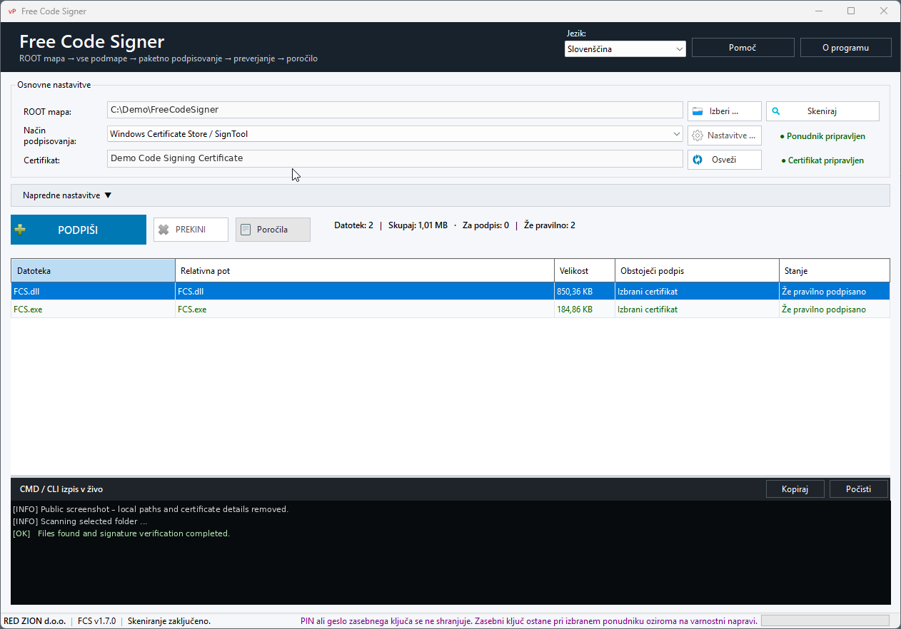

### What's new in v1.7.1

- Right-click a file to **open its location** in Windows Explorer.
- Right-click a signed file to **show its signing certificate**.
- A new certificate-details button next to the selected Windows certificate opens extended certificate information.
- Certificate details include Subject, Issuer, validity, serial number, SHA-1, SHA-256, public key, signature algorithm, private-key availability, EKU and certificate-chain status.
- Signed JAR certificate display is supported when JDK/keytool is available.
- SignTool non-zero exit codes are no longer treated as an automatic failure of every file in a batch.
- Files are re-verified after ambiguous SignTool/provider errors and correctly recovered when the expected signature was actually written.
- This improves YubiKey/PIV, smart-card and HSM workflows.
- Large-batch verification no longer needs to launch one SignTool process per file.
- Live CLI output is buffered and the visible console is bounded for better UI stability on large jobs.
- Unexpected exceptions are written to `%LOCALAPPDATA%\FreeCodeSigner\CrashLogs`.
- Built-in Help was extended with certificate/file actions and crash-log guidance.
- All new v1.7.1 strings are localized in all **25 interface languages**.

## Signing methods

Free Code Signer supports several signing methods from the same interface.

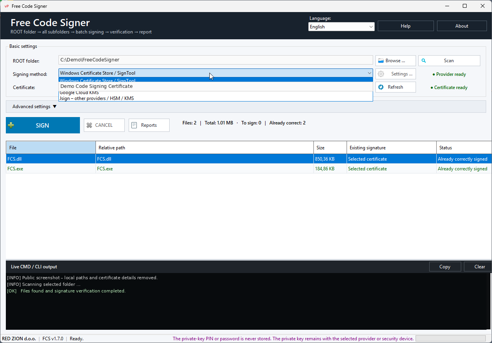

### Microsoft SignTool

Use certificates available through Windows Certificate Store, including compatible hardware-backed certificates such as YubiKey/PIV.

### Azure Artifact Signing

Use Microsoft Azure Artifact Signing for cloud-based signing where the private signing key remains protected by the Azure signing infrastructure.

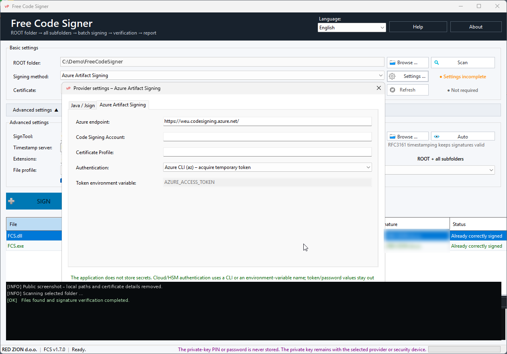

### Google Cloud KMS

Use signing keys protected by Google Cloud KMS through the Jsign integration.

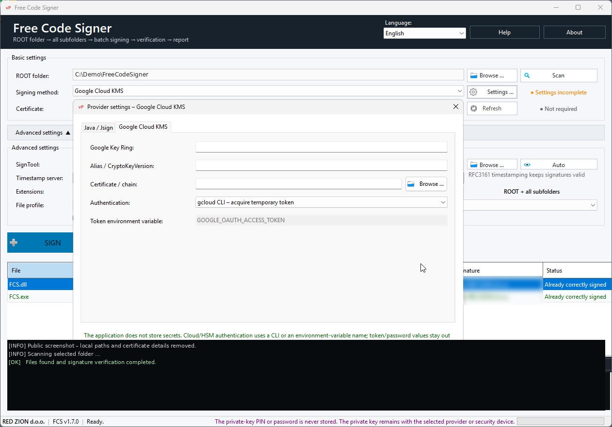

### Jsign

Jsign expands compatibility with compatible cloud KMS providers, HSM devices, PKCS#11 devices, hardware tokens and remote signing services.

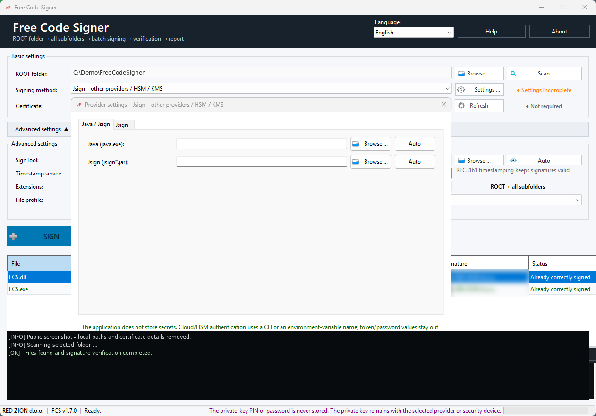

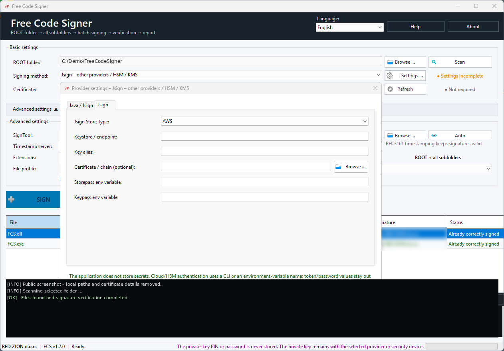

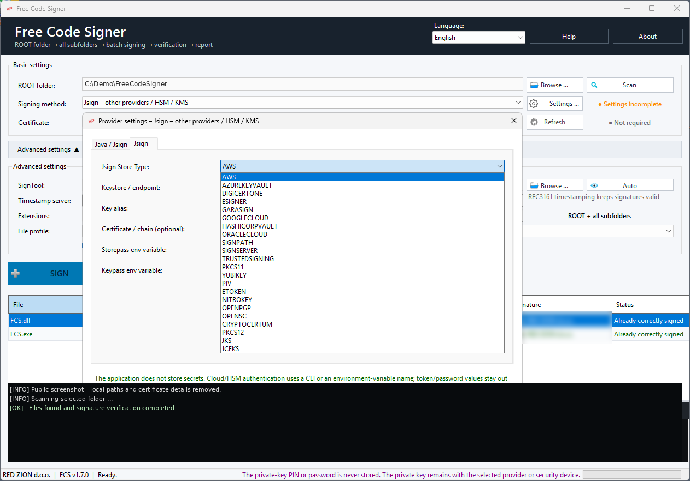

## JAR signing

Java `.jar` files are signed using Java `jarsigner`.

Because JAR signing is not Windows Authenticode signing, Free Code Signer handles JAR files through a separate Java signing workflow.

A compatible JDK is required when JAR signing is used.

## File profiles

Free Code Signer provides predefined file-selection profiles:

- **Standard**
- **Extended**
- **Extended + JAR**
- **Custom**

Manual extension editing remains available.

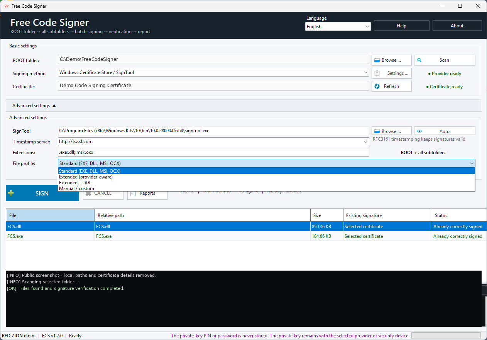

## Advanced settings

Provider-specific and advanced signing parameters are available when required.

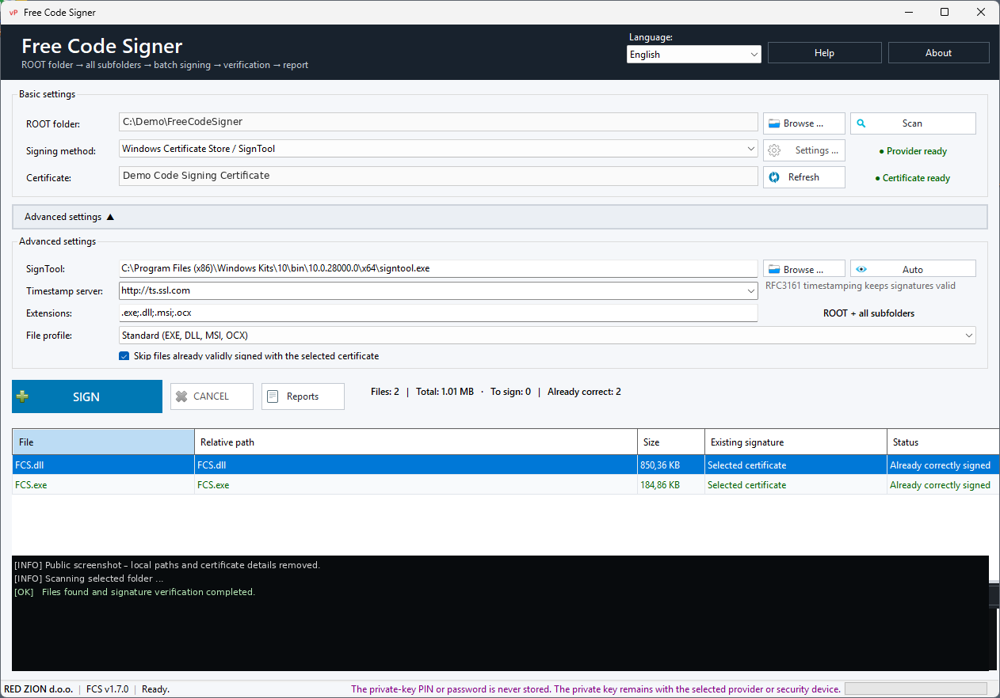

## Timestamping

Timestamping can preserve the validity of a signature after the signing certificate itself expires, provided the signature was valid at signing time and the timestamp remains trusted.

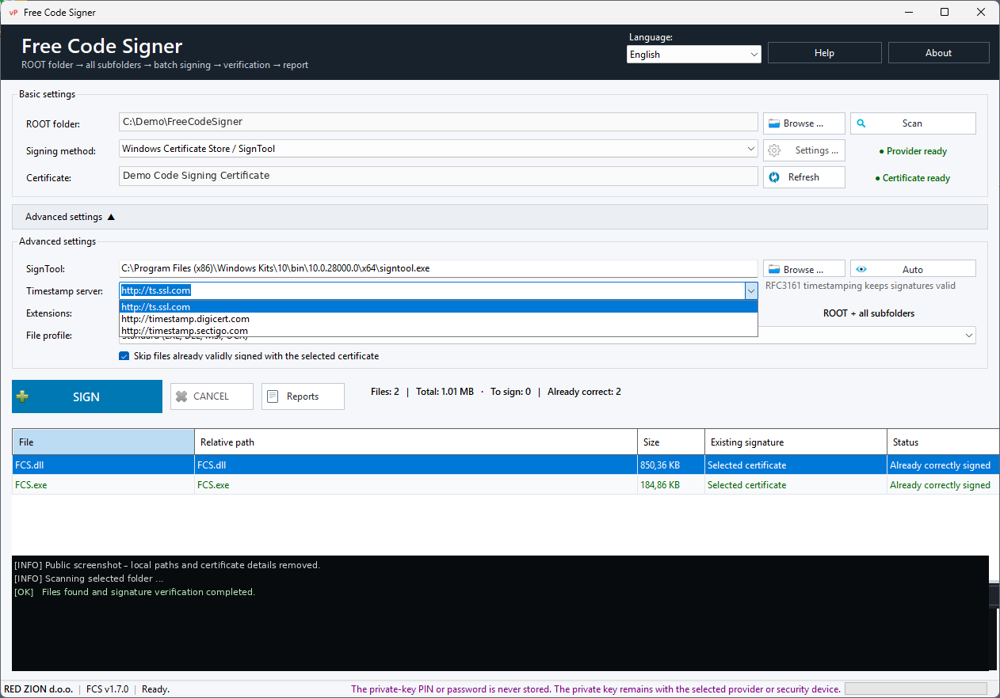

## Built-in Help

Free Code Signer includes complete offline help directly in the application.

Press **F1** or click **Help**.

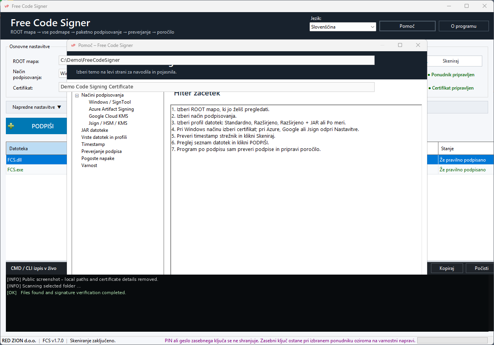

The help covers:

- Quick Start
- Microsoft SignTool
- Azure Artifact Signing
- Google Cloud KMS
- Jsign
- JAR signing
- file profiles
- timestamping
- signature verification
- certificate and file actions
- crash logs
- troubleshooting
- security

Detailed GitHub documentation:

- [English Help](HELP-EN.md)
- [Slovenska pomoč](HELP-SL.md)

## Languages

Free Code Signer includes **25 interface languages**:

Bulgarian, Croatian, Czech, Danish, Dutch, English, Estonian, Finnish, French, German, Greek, Hungarian, Irish, Italian, Latvian, Lithuanian, Maltese, Polish, Portuguese, Romanian, Slovak, Slovenian, Spanish, Swedish and Ukrainian.

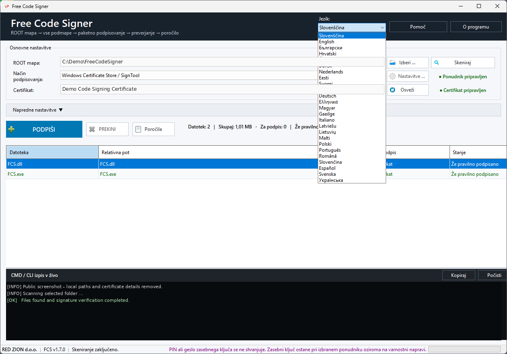

The selected language is remembered between application sessions.

## Stability and verification

Free Code Signer verifies signatures after signing instead of relying only on the process exit code returned by the signing provider.

This is particularly useful with hardware-backed signing, where a smart-card/HSM provider can occasionally return a non-zero status after a valid signature has already been written.

Version 1.7.1 also buffers live CLI output and bounds the visible console to improve stability during large signing jobs.

## Crash diagnostics

Unexpected application errors are written to:

`%LOCALAPPDATA%\FreeCodeSigner\CrashLogs`

The log contains diagnostic information intended to help identify unexpected UI or signing-workflow failures.

## Security

Free Code Signer is designed so that sensitive signing credentials do not need to be stored in its normal configuration.

Depending on the selected provider, authentication should remain managed by the operating system, certificate store, hardware token, HSM or cloud provider.

Sensitive information such as private keys, PINs, passwords, access tokens and client secrets should not be stored as plain application settings.

## Requirements

Requirements depend on the selected signing method:

| Signing method | Typical requirement |
|---|---|
| Microsoft SignTool | Windows + Microsoft SignTool / Windows SDK |
| Hardware certificate | Compatible certificate/token middleware |
| Azure Artifact Signing | Azure account and configured Artifact Signing resources |
| Google Cloud KMS | Google Cloud authentication/configuration and Jsign |
| Jsign | Compatible Java runtime/Jsign setup and provider configuration |
| JAR | Compatible JDK with `jarsigner` / `keytool` |

The original Windows Certificate Store / Microsoft SignTool workflow remains available.

## Download

**[Download Free Code Signer v1.7.1](https://github.com/varnaPot/FreeCodeSigner/releases/tag/v1.7.1)**

## ☕ Support the project

Free Code Signer is free to use and distribute.

If you find the application useful and would like to support its continued development, you can buy me a coffee.

## License

Free Code Signer is **freeware** and may be used and distributed free of charge according to the included license terms.

The public release does **not** include the source code.

See `LICENSE.txt` for details.

---

**Free Code Signer**  
© 2026 RED ZION d.o.o.
